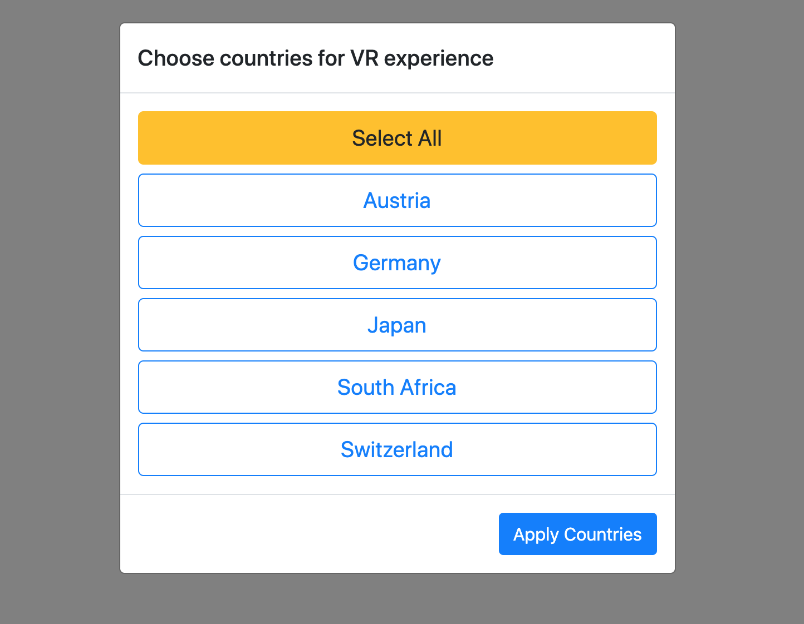
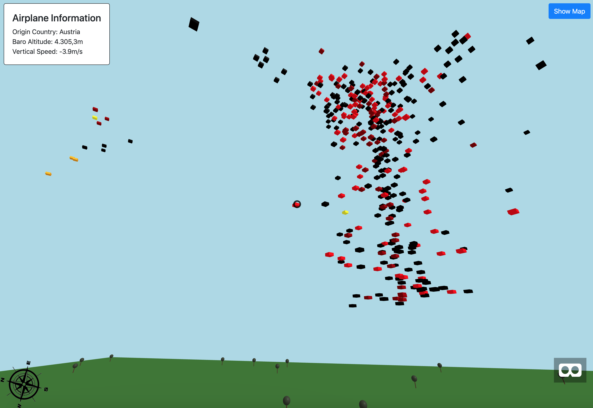
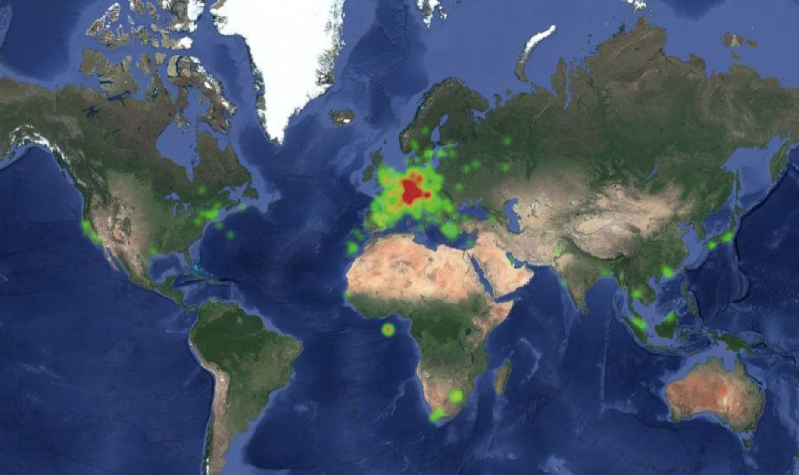

# Flight Traffic Visualization 

## Introduction

The aim of the project is to visualize the current air traffic in a three dimensional layer. Therefore I am consuming data from the Opensky Network (https://opensky-network.org/).

The library Aframe.js enables the possibility to show elements in a Virtual Reality environment in the browser.
The whole project is deployed on http://www.martinislitzer.at/visualanalytics.


## Code and Visualizations

I am using jQuery in combination with the AFrame library.

### Selection of countries to show

*This image shows the initial screen of the application where you can select the origin countries to show later on the visualization.*

On applying the modal selection, i will run the following code:

``` js
jq("body").on("click", "#applyCountries", function () {
    if (countrySelection.length) {
        jq("#vrModal").modal('toggle');
        jq("#vrModal #alert").hide();

        drawAthmosphere();
        doRequests(true, "VR", 10000);

        createCompass();
    }
    else {
        jq("#vrModal #alert").slideToggle();
    }
});
```

*The first important part of this section is the drawing of the 3d athomsphere in AFrame. The second part is accessing the data within the API with a polling interval of 10 seconds.*

### Main VR Visualization

*This image shows the loaded traffic data shown as boxes in x, y and z axis. On hovering an airplane, additional data like the origin country, altitude and vertical speed will shown.
On the bottom right part of the view you have the possibility to switch to the VR mode to use with a glass or a Google cardboard.*


```js
function drawAthmosphere() {
	var athmosphere = "";
	athmosphere += openScene("main-scene-wrapper");
	athmosphere += drawGround();
	athmosphere += drawTrees(20, ["t", "r"]);
	athmosphere += drawTrees(20, ["b", "r"]);
	athmosphere += drawTrees(20, ["t", "l"]);
	athmosphere += drawTrees(20, ["b", "l"]);
	athmosphere += '<a-sky color="lightblue"></a-sky>';
	athmosphere += '<a-entity rotation="0 0 0" camera="userHeight: 1.6" look-controls><a-cursor></a-cursor></a-entity>';

	athmosphere += closeScene();

	jq(".main-scene").append(athmosphere);
}
```
*Here you can see the drawAthmosphere() method in detailed action where an Aframe.js instance gets drawed.*

```js
function drawAirplaneDataVr(filteredData, update) {
	var scene = "";
	scene += '<a-entity id="inner-data">';
	jq.each(filteredData, function (key, val) {
		var lat = val[getField("latitude")];
		var lng = val[getField("longitude")];
        var alt = val[getField("baro_altitude")];

        // altitude scale
        var usedAlt = (alt / 200);

		if (!update) {
			registerComponents(key, val);
		}
		else {
			updateComponents(key, val);
		}

		if (alt != null && alt > 1000) {
			scene += '<a-box height=".5" width="1" position="' + lat + ' ' + usedAlt + ' ' + lng + '" rotation="0 45 0" color="' + getColor(val[getField("origin_country")]) + '" aircraft_' + key + '>';
			scene += '</a-box>';
		}
	});

	scene += '</a-entity>';

	if (update) {
		jq(".main-scene #main-scene-wrapper #inner-data").html(scene);
	}
	else {
		jq(".main-scene #main-scene-wrapper").append(scene);
	}
}
```
*This code snippet shows the main drawing events for the flight traffic data. I scaled the corresponding altitude value of the airplane by a fixed factor of 200.*

### Map of the returned data

*To give an overall preview about the data, I'm using an additional Google Map with a covering heatmap layer.*


## Used Attributes
The HTTP response provides a various set of data attributes which are representing basically technically data which is not further of importance.

The following attributes are used in the application:
+ origin_country
+ latitude
+ longitude
+ baro_altitude
+ vertical_rate
